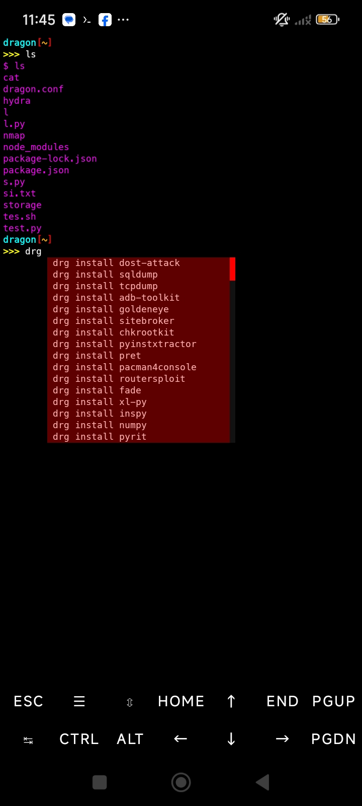
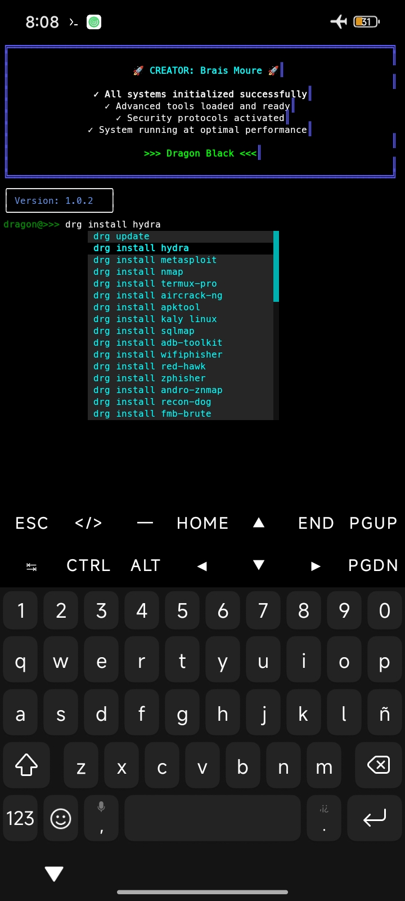

# **Dragon-Black**
<p align="center">
  
</p>

<p align="center">
  <strong>Enhance Termux with Dragon-Black!</strong>


<p align="center">
  
  
  
  <br>
  
   <a href="https://www.youtube.com/@Brais-Dev?si=NNuXTcjqGPGISetL"></a>
</p>
</p>

**Dragon-Black CLI** a command-line tool that allows you to easily install packages or tools in Termux.
A powerful tool with intuitive and customizable interface, featuring advanced systems including multilingual support (Spanish, English) and support for external plugins

---
## **📸 Screenshots**
<p align="center">
  
  
</p>
<p align="center">
  <em>showing Dragon-Black's interface.</em>
</p>

---

## 📘 **Table of Contents**
[Plugin Development](./docs/PLUGIN_DEVELOPMENT.md)

[Plugin Installation](./docs/PLUGIN_INSTALLATION.md)

[System Commands](./docs/COMMANDS.md)

[Full guide](./docs/GUIDE.md)


## **✨ Features**
- **🚀 Automatic configuration**: Configure Dragon-Black with a single command
- **➡️ Autocompletion**: Dragon-Black includes advanced autocompletion for commands
- **📱 Typing suggestions**: while typing a command, suggestions are displayed in a window
- **💻 Termux terminal control**: "You can execute any Termux shell command without any problems"
- **📦 Packages**: many packages available in one place to download
- **🗳️ Plugin manager**: you can distribute your own tools in Dragon-Black enhancing its functionality
- **🌐 Multilingual system:** multilingual system Spanish and English
---

# **🛠️ Tools**
**Dragon-Black** also includes its own tools that you can use for various needs.

---
# **🛸 Technologies Used**
**Dragon-Black** uses the **Bash** language for automatic configurations and various needs. Its source code, especially the entire program, is written in **Python🐍**
uses third-party libraries to improve its stability and handling of keyboard functions, etc.

---

## 💻 Order and Organization
Dragon-Black is a very well organized and structured program that manages data files in its own directory, avoiding the creation of unnecessary files to prevent increased RAM memory usage
works automatically with data in its own directory

**Note:**
plugin installation may increase RAM memory consumption

---

## **🧐 Why we can choose Dragon-Black**
- **Automatic configuration**: no manual processes, fully automatic process
- **daily maintenance**: the Dragon-Black team looks for problems and solves them quickly in the tool
- **compatible with Termux** created, developed especially for Android users
- **integration of external tools**: plugin system that allows the community to participate in the development of Dragon-Black by distributing their own tools
- **package manager**: you can download any package that is not available in Termux such as "Hacking Packages"
- **customizable interface**: you can customize the appearance of the tool
- **complete functions**: complete functions like any other tool
- **compatible with shell** fully compatible with Termux shell, you can execute any external command without problems
- **commands**: includes its own commands like any other system
- **error handling**: advanced error handling system that prevents the program from breaking easily
- **command handling**: avoids command combination conflicts between shell
- **data handling**: the data files created are saved in its directory to avoid RAM additions
- **multilingual system**: multilingual system (English and Spanish)


## **📋 Prerequisites**
- **internet connection**
- **Termux** installed
- **Git** installed (`apt install git`)
- **Python3** installed (`apt install Python3`)
---

## **📥 Installation**

1.  **Copy and paste the following commands**
    ```bash
    apt install git -y
    apt install python3 -y
    git clone https://github.com/Brais-Dev/Dragon-Black.git
    cd Dragon-Black
    ```
2.  **execute the following script to configure Dragon-Black**
    ```bash
    bash configure_dragon.sh
    ```
3.  **to start Dragon-Black execute the following command**
    ```bash
    dragon
    ```
    If the configuration was done correctly the command **"dragon"** will remain global


---

## **📂 Structure**
```
Dragon-Black/
├── assets/             # Images
├── bin/                # Global command (dragon)
├── core/               # Configuration files
├── modules/            # Dragon-Black modules
├── utils/              # Dependency installation scripts
├── data/               # Language files
├── dragon.py           # Main script
├── configure_dragon.sh # Dragon-Black configurator
├── LICENSE             # Project license
├── README.md           # This file
```
---

## **🤖 Using Dragon-Black**
see the complete guide here!!
[Dragon-Black guide](docs/GUIDE.md)

---

## **🗳️ Plugin Manager**
plugins are external tools that we can distribute in Dragon-Black, that is, we can add our own tools to Dragon-Black

Dragon-Black has a separate repository for the plugin manager where we can distribute our own tools to enhance Dragon-Black's functionality

**what kind of tools can we implement in Dragon-Black?**
in Dragon-Black we can integrate the tools that we want
whether for
- **Hacking**
- **Programming**
- **Automation**


and much more.
these tools can be distributed through the plugin manager repository [Dragon-Black-Plugins](https://guthub.com/Brais-Dev/Dragon-Black-Plugins)

**Note:** more information here!!
[Dragon-Black-Plugins](docs/PLUGIN_DEVELOPMENT.md)

---

## **🎓 Community and Learning**
Learn how to use this tool, to get the most out of Termux
Visit the official **Brais Moure** channel

- **📺 YouTube channel**:
[Brais Moure](https://www.youtube.com/@Brais-Dev?si=NNuXTcjqGPGISetL)

---

## **🤝 Contributions**
!Contributions are welcome!
You can open issues or send pull requests

---

## **👤 Author**
Dragon-Black created by **Brais Moure**
developed for automation and educational use

---

## **📄 License**
This project is under the **MIT License**
see the `LICENSE` file for more details.

---

**Dragon-Black** will continue to be developed with the aim of having everything needed in a single tool for both programming and ethical hacking.
keep Dragon-Black updated so that new improvements can reach you.
don't forget to give **star ⭐** on this repository

---
<p align="center">
  <em>Thank you for using Dragon-Black!</em>
</p>
